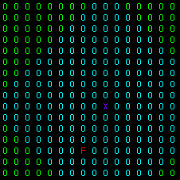

# Experiment 2

**Number of agents**: 1
  
**Number of food particle(s)**: 1
  
**World Size**: 16 x 16
  
**Scope**: 10
  
**State Size**: 4
  
**Action Size**: 4
  
**Algorithm**: REINFORCE
  
**NN**: 2 Layer FC [4 -> 16 (ReLU) -> 4 (Softmax)]
  
**Optimizer**: Adam (LR=1e-2)
  
**Model Updates**: At the end of episode
  
**Starting position of Agent**: Random 
  
**Position of food particle(s)**: Random
  
**Agent Representation**: X (Indigo)
  
**Food Representation**: F (Red)
  
**Cell Representation when not in scope**: O (Green)
  
**Cell Representation when in scope**: O (Light Blue)

## Scope 

Distance to which an agent can perceive the world. Distance here is Manhattan Distance.

## State Description

The state consists of four zeroes if food particle is outside scope, otherwise it consists of the distance vector (x, y) to the food particle and a direction vector which points towards the direction of the food particle.

In this position the state is [-5, 2, -1, 1] which corresponds to the distance in x, y, and direction in x, y towards the food particle.

## Actions

The agent can take **four** different actions:-

1) Action 0 - Move up
2) Action 1 - Move down
3) Action 2 - Move left
4) Action 3 - Move right

## Results

**Number of training episodes**: 5000
  
**Maximum number of steps**: 100
  
**Number of testing episodes**: 5000
  
**Training success ratio**: 0.7962
  
**Testing success ratio**: 0.794

