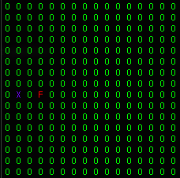

# Experiment 1

**Number of agents**: 1
  
**Number of food particle(s)**: 1
  
**World Size**: 16 x 16
  
**State Size**: 8
  
**Action Size**: 4
  
**Algorithm**: REINFORCE
  
**NN**: 2 Layer FC [8 -> 16 (ReLU) -> 4 (Softmax)]
  
**Optimizer**: Adam (LR=1e-2)
  
**Model Updates**: At the end of episode
  
**Starting position of Agent**: Random 
  
**Position of food particle(s)**: Random
  
**Agent Representation**: X (Indigo)
  
**Food Representation**: F (Red)
  
**Cell Representation**: O (Green)

## State Description

The state is the distance of the food particle from the agent when it moves one place in 8 directions (N, E, S, W, NE, NW, SE, SW in order).

In this position the state is [2, 2, 4, 4, 1, 3, 3, 5] which corresponds to the Manhattan Distance when the agent moves one position to N, E, S, W, NE, NW, SE, SW direction respectively.

## Actions

The agent can take **four** different actions:-

1) Action 0 - Move up
2) Action 1 - Move down
3) Action 2 - Move left
4) Action 3 - Move right

## Results

**Number of training episodes**: 5000
  
**Maximum number of steps**: 100
  
**Number of testing episodes**: 5000
  
**Training success ratio**: 0.8504
  
**Testing success ratio**: 1.0

