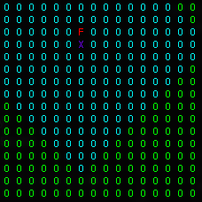

# Experiment 2

**Number of agents**: 1
  
**Number of food particle(s)**: 1
  
**World Size**: 16 x 16
  
**Scope**: 10
  
**State Size**: 2
  
**Action Size**: 4
  
**Algorithm**: REINFORCE
  
**NN**: 2 Layer FC [2 -> 16 (ReLU) -> 4 (Softmax)]
  
**Optimizer**: Adam (LR=1e-2)
  
**Model Updates**: At the end of episode
  
**Starting position of Agent**: Random 
  
**Position of food particle(s)**: Random
  
**Agent Representation**: X (Indigo)
  
**Food Representation**: F (Red)
  
**Cell Representation when not in scope**: O (None)
  
**Cell Representation when in scope**: O (Light Blue)

## Scope 

Distance to which an agent can perceive the world. Distance here is Manhattan Distance.

## State Description

The state consists of two zeroes if food particle is outside scope, otherwise it consists of the distance vector (x, y) to the food particle.

In this position the state is [-5, 2, -1, 1] which corresponds to the distance in x, y, and direction in x, y towards the food particle.

## Actions

The agent can take **four** different actions:-

1) Action 0 - Move up
2) Action 1 - Move down
3) Action 2 - Move left
4) Action 3 - Move right

## Results

**Number of training episodes**: 5000
  
**Maximum number of steps**: 100
  
**Number of testing episodes**: 5000
  
**Training success ratio**: 0.7434
  
**Testing success ratio**: 0.7606

