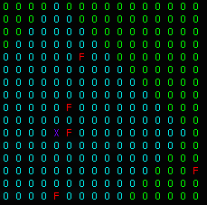

# Experiment 7

**Number of agents**: 1
  
**Number of food particle(s)**: 5
  
**World Size**: 16 x 16
  
**Scope**: 10
  
**State Size**: 10
  
**Action Size**: 4
  
**Algorithm**: REINFORCE
  
**NN**: 2 Layer FC [10 -> 16 (ReLU) -> 4 (Softmax)]
  
**Optimizer**: Adam (LR=1e-2)
  
**Model Updates**: At the end of episode
  
**Starting position of Agent**: Random 
  
**Position of food particle(s)**: Random
  
**Agent Representation**: X (Indigo)
  
**Food Representation**: F (Red)
  
**Cell Representation when not in scope**: O (None)
  
**Cell Representation when in scope**: O (Light Blue)

## Solving the environment

There is no condition for the environment to be considered solved.

## Scope 

Distance to which an agent can perceive the world. Distance here is Manhattan Distance.

## State Description

The state consists of 10 zeroes if food particle is outside scope, otherwise it consists of the distance vector (x, y) to all the food particles.

In this position the state is [-1, -1, -6, 0, 0, 0, 1, -1, 5, -2] which corresponds to the distance in x, y, to the food particles.

## Actions

The agent can take **four** different actions:-

1) Action 0 - Move up
2) Action 1 - Move down
3) Action 2 - Move left
4) Action 3 - Move right

## Results

**Number of training episodes**: 5000
  
**Maximum number of steps**: 100
  
**Number of testing episodes**: 5000
  
**Training success ratio**: Does not apply
  
**Testing success ratio**: Does not apply

